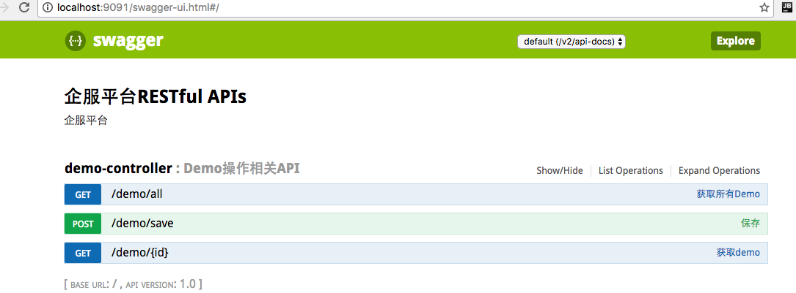

## 项目集成说明
####依赖管理：Gradle
####开发工具: IDEA
####依赖包：

1.springboot

2.mybtis

3.mybatis-mapper(三方扩展插件)

4.mybtis-pagehelper(三方扩展插件)

####数据库：mysql

## Mybatis Generator使用说明

1.mybatis Generator配置目录在gradle.properties，其中配置了数据库连接，文件生成路径

2.mybatis Generator配置文件在 resulrces/generator/generatorConfig.xml
注：前期可以使用全部生成，后期只能部分表生成。因为全部生成会覆盖掉以前的代码。

3.在Gradle执行mybatis Generator：

````
	gradle mybatisGenerate
````

## Springboot 使用说明

启动springboot 

1. 可以直接运行 main 方法

2. 通过命令启动(不推荐：终止启动命令，但是服务不会停止。

````
    gradle bootRun
````

服务运行端口详见application.yml 

````
    server:
        port: 9091
````

## API接口文档[Swagger2]
1.项目启动之后，可以通过 http://localhost:9091/swagger-ui.html 访问。




